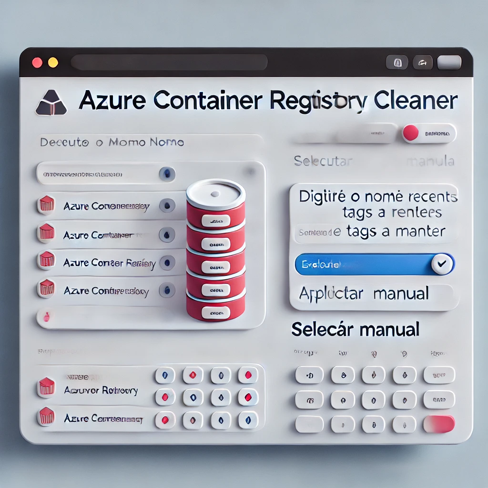

# Azure Container Registry Cleaner



## Overview

This project provides a simple interface for managing and cleaning up images in Azure Container Registry (ACR) using Streamlit. You can select multiple ACRs, specify the number of recent tags to keep, and manually select which tags to delete.

## Prerequisites

- Docker installed on your system
- Azure CLI installed and configured

## Running the Application

### Step 1: Build and Run the Docker Container

Build the Docker image (if not already built):
```bash
docker build -t acr_cleaner .
```

Run the Docker container:
```bash
docker run -it -p 8501:8501 acr_cleaner bash
```

### Step 2: Authenticate with Azure

Inside the Docker container, authenticate with Azure:
```bash
az login
```

### Step 3: Run the Streamlit Application

After logging in, start the Streamlit application:
```bash
streamlit run acr_cleaner.py
```

### Step 4: Access the Application

Open your web browser and go to:
```
http://localhost:8501
```

You can now use the interface to select ACRs, specify tags to keep, and clean up images.

## Features

- **Multiple ACR Selection**: Select one or more ACRs for cleaning.
- **Manual Tag Selection**: Optionally manually select which tags to keep for each repository.
- **Automated Cleanup**: Specify the number of recent tags to keep, and the application will delete the rest.

## Important Notes

- Ensure that you have sufficient permissions to manage ACRs in your Azure account.
- This tool assumes that your Azure CLI is configured correctly and that you have access to the ACRs you intend to manage.

## Contact

For any issues or questions, feel free to reach out. hudson.erik@gmail.com